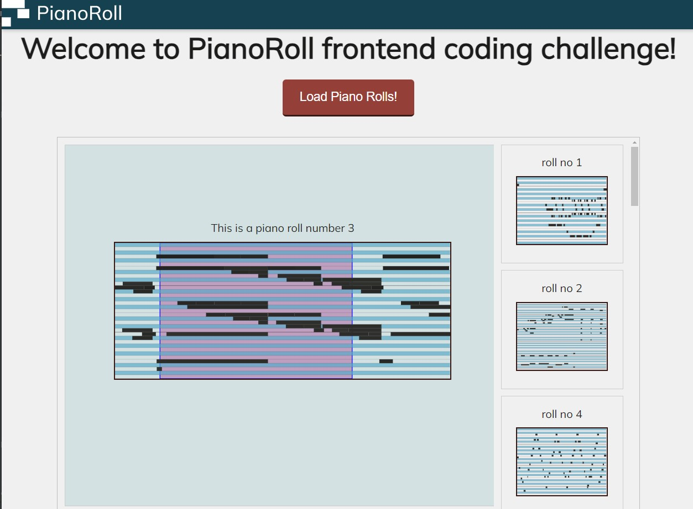
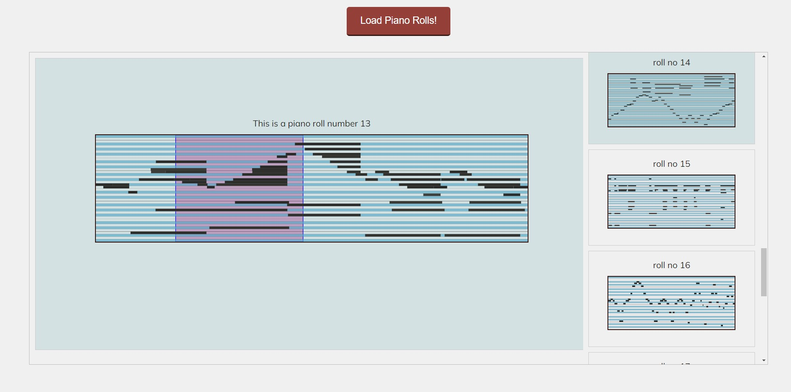
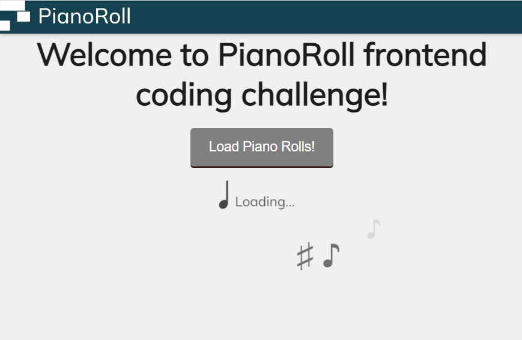
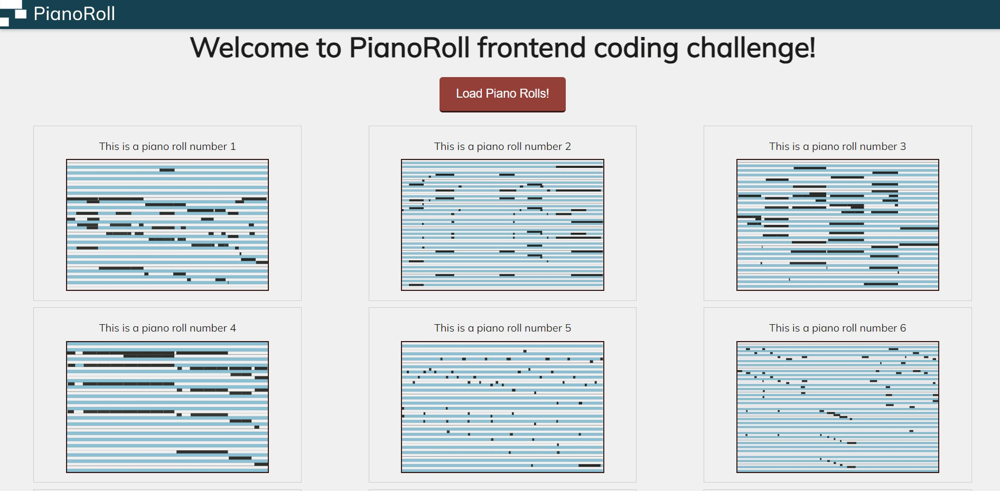
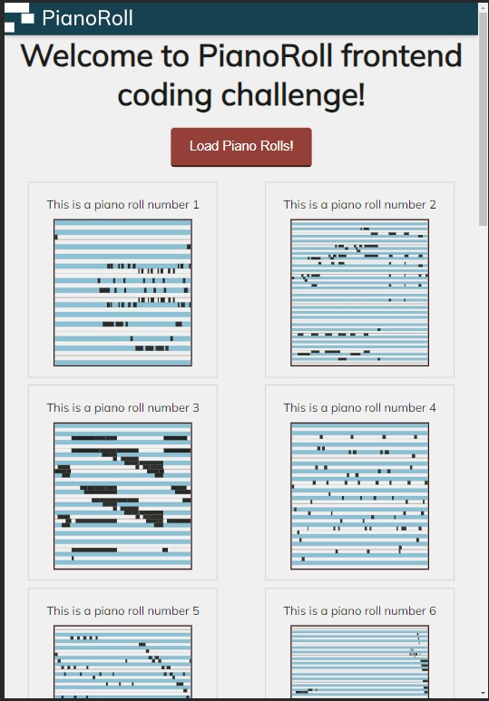
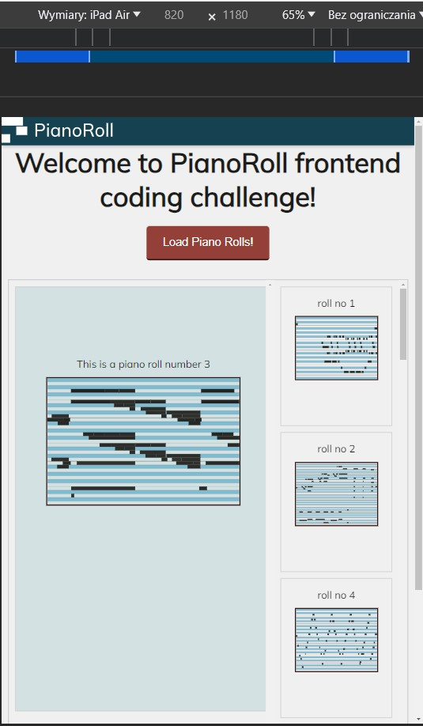

# PianoRoll Frontend Challenge

Welcome to the repository containing my solution to a PianoRoll Frontend Challenge task. 
Task description and source code you can find here:
[Link to Source Repository](https://github.com/Nospoko/pianoroll-frontend-challenge)

### Screencast: 

* version 1
[https://www.youtube.com/watch?v=8VyXMGGAjL8](https://www.youtube.com/watch?v=8VyXMGGAjL8)
 
* vesrion 2 
[https://youtu.be/cBC8KD-w4jI](https://youtu.be/cBC8KD-w4jI)

### Description: 
The solution has been implemented using React, TypeScript and CSS.

### Running Instructions:

To run this solution on your local machine, follow these steps:

* Clone this repository to your local computer.
* Navigate to the project directory.
* Open a terminal and run the npm install command to install all the necessary dependencies.
* After the installation is complete, start the application by running the `npm run dev` command.
* The application should now be accessible in your browser at http://localhost:5173/

### Screenshots:

